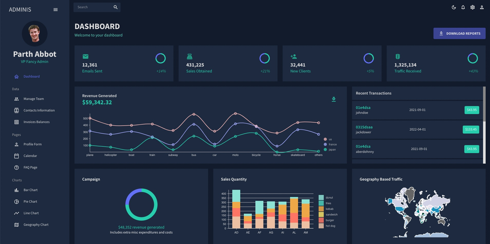
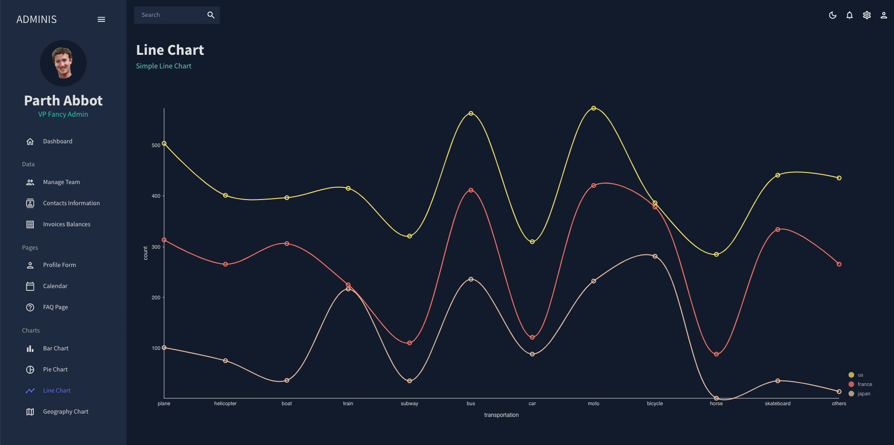
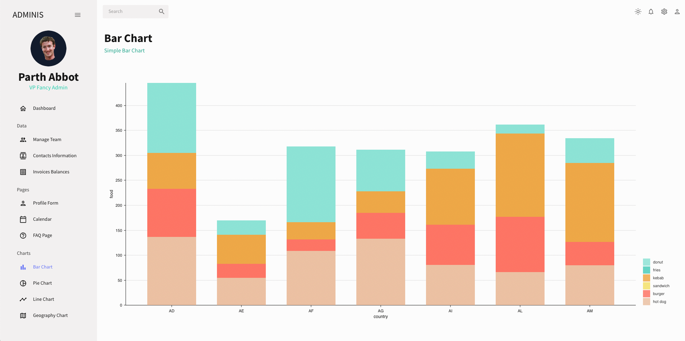
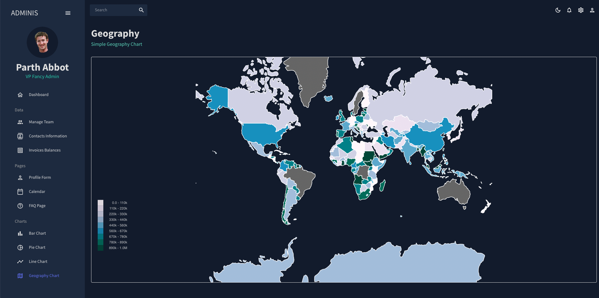

# Full-Stack-Admin-Data-Analysis-Tool-
   
   
   
   

The Full-Stack Admin Data Analysis Tool is a MERN stack application that provides a comprehensive analysis of customer sales and monthly sales reports for the owner (admin). It includes multiple graphs to represent the data, offering a visual and interactive way to explore the sales data.

## Features

- Analyze customer sales data
- Generate monthly sales reports
- Multiple graphs for data visualization
- User-friendly interface for easy navigation
- Secure login for admin access

## Technologies Used

- **M**ongoDB: NoSQL database for storing data
- **E**xpress: Node.js web application framework for building APIs
- **R**eact: JavaScript library for building user interfaces
- **N**ode.js: JavaScript runtime environment for server-side logic
- GraphQL for data querying
- Moon.io components for UI elements

## Getting Started

To get started with this project, follow these steps:

1. Clone the repository: from the link given above
2. Install dependencies: `npm install`
3. Start the development server: `npm start`

## Usage

Once the development server is running, you can access the application in your web browser. Use the various graphs to explore and analyze customer sales data. Generate monthly sales reports to track performance over time.

## Contributing

If you'd like to contribute to this project, please fork the repository and submit a pull request. You can also open an issue to report bugs or suggest new features.

